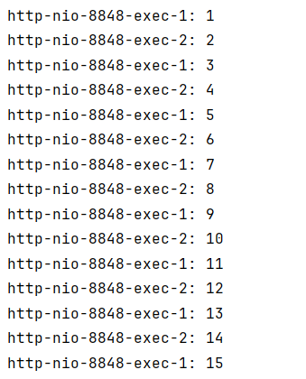
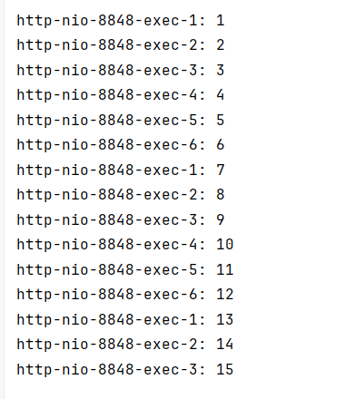
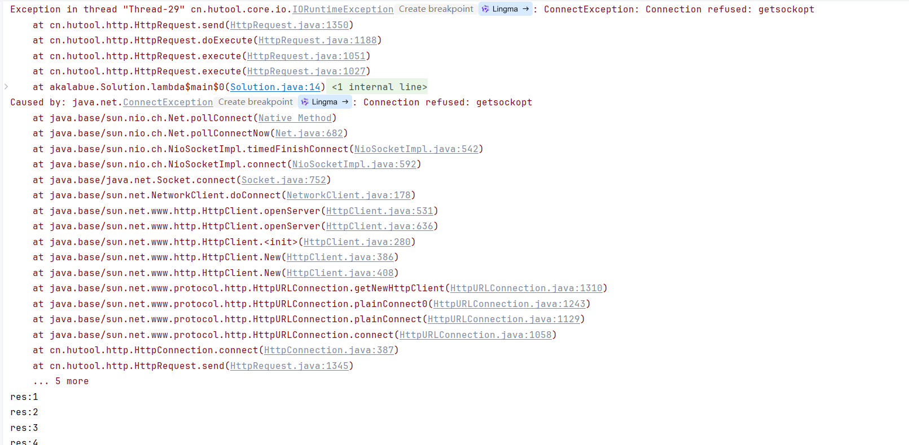

Tomcat是一个轻量级的Web应用服务器，可以运行各种Servlet和JSP应用。SpringBoot本身只是一个框架，并不具备运行服务的功能，启动springboot程序时本
质上是启动了一个tomcat服务，在后台监听端口，接受请求。
### tomcat配置
在 Spring Boot 中配置嵌入式 Tomcat 的参数非常简单，主要通过 application.properties 或 application.yml 文件来进行配置。
下面是一些常见的 Tomcat 参数及其说明： 

**Max Threads**: 最大线程数，即并发处理的最大线程数。  
**Max Connections**: 最大连接数，即同时接受的最大连接数。  
**Accept Count**: 接受队列的大小，当所有可能的线程都在使用时，此值表示等待队列的长度。  
**Connection Timeout**: 连接超时时间，单位为毫秒。  
**Min Spare Threads**: 最小空闲线程数，在任何时间都应该准备好的最少线程数。  
**Max HTTP Form Post Size**: 最大 POST 请求大小，单位通常是字节。

以下是springboot默认的tomcat参数配置：
```yml
server.tomcat.max-threads=200
server.tomcat.min-spare-threads=5
server.tomcat.max-connections=10000
server.tomcat.accept-count=100
server.tomcat.connection-timeout=20000
server.tomcat.max-http-form-post-size=1MB
```

### 配置测试
接下来我们通过实际操作来测试一下tomcat的配置是否生效，首先为了便于测试，我们将tomcat的配置参数设置为一个较小的值，然后通过代码工具发送http请求，
查看配置是否生效。
```properties
server.tomcat.max-threads=6
server.tomcat.min-spare-threads=2
server.tomcat.max-connections=12
server.tomcat.accept-count=3
```
首先，我们通过代码工具发送http请求，查看配置是否生效。代码如下：
```java
public class Solution {
    public static void main(String[] args) throws InterruptedException {
        String base = "http://localhost:8848/test?param=";
        for(int i = 1; i <= 30; i++){
            String url = base + i;
            new Thread(() -> {
                //请求超时时间设置极大，防止干扰实验结果
                HttpResponse execute = HttpRequest.get(url).timeout(1000000).execute();
                System.out.println("res:" + execute.body());
            }).start();
            Thread.sleep(200);
        }
    }
}
```
在代码中，我们通过HttpRequest工具类发送了30个http请求，每个请求的url都包含一个参数，参数的值从1到30。请求超时时间设置极大，防止干扰实验结果。  

先看正常处理，接受请求后立马打印当前线程信息，返回结果：
```java
@RestController
public class MainController {

    @RequestMapping("/test")
    public int test(int param) throws InterruptedException {
        System.out.println(Thread.currentThread().getName() + ": " + param);
        return param;
    }
}
```
实验结果如下：  
  
可以观察到就两个线程在工作，满足设置```server.tomcat.accept-count=2```  
接下来我们把处理线程阻塞一会，再观察：
```java
@RestController
public class MainController {

    @RequestMapping("/test")
    public int test(int param) throws InterruptedException {
        System.out.println(Thread.currentThread().getName() + ": " + param);
        //阻塞请求10秒
        Thread.sleep(10000);
        return param;
    }
}
```
实验结果如下：  
  
客户端报错：
  
可以看到，这次的工作线程有6个了，满足```server.tomcat.max-threads=6```设置，而且最终处理了15个请求，我们一共发了30个请求，其余15个就报错了。
报错原因如下：```Caused by: java.net.ConnectException: Connection refused: getsockopt```,可以看出是连接被拒绝。
这是因为我们配置的```server.tomcat.max-connections=12```最大连接数是12，```server.tomcat.accept-count=3```等待队列是3。  
处理过程如下： 
第1、2个请求到达时从最小空闲线程池中获取线程去处理。  
当第3、4、5、6个请求到达时，前面两个线程还在阻塞中，所以得创建新的线程去处理。  
当后面7、8、9、10、11、12个请求到达时，前面6个线程还在阻塞中，但此时已经是最大线程数了，所以只能阻塞、但这些线程是已经连接的。  
第13、14、15个请求到达时，已经满足最大连接数，所以这三个请求会进入阻塞队列，之后在拿出来处理。
这样其余15个请求就会被拒绝连接。
